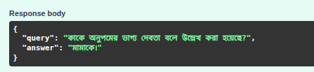
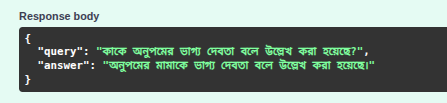
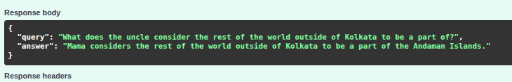
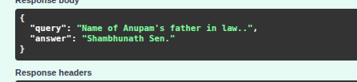

# Multilingual-RAG-System

## Project Overview

This project implements a Multilingual Retrieval-Augmented Generation (RAG) System designed to answer user questions using a combination of document retrieval and generative AI. The system is tailored to answer in Bengali, translating questions if necessary, and always provides concise, context-based answers. It leverages OCR to extract text from PDFs, splits documents into manageable chunks, embeds them, and stores them in Pinecone for efficient retrieval.

**Key Features:**
- Multilingual question answering (focus on Bengali)
- Uses Google Gemini for both embeddings and LLM
- Pinecone for vector storage and retrieval
- FastAPI backend with a `/api/v1/ask` endpoint
- Document ingestion pipeline: PDF → OCR → text → chunking → embedding → Pinecone

## Setup Instructions

### 1. Clone the Repository
```bash
git clone https://github.com/imsnto/Multilingual-RAG-System.git
cd Multilingual-RAG-System
```

### 2. Install Dependencies
```bash
pip install -r requirements.txt
```

### 3. Environment Variables
Create a `.env` file in the root directory with the following variables:
```
PINECONE_API_KEY=your-pinecone-api-key
GEMINI_API_KEY=your-google-gemini-api-key
EMBEDDING_MODEL_NAME=models/gemini-embedding-exp-03-07
PINECONE_INDEX_NAME=my-rag-index-2
PINECONE_ENVIRONMENT=aws
LLM_MODEL_NAME=gemini-2.5-pro
```

### 4. Ingest Documents
To process and ingest your documents (e.g., PDFs) into Pinecone, run:
```bash
python app/utils/vector_store.py
```
This will extract text from the PDF, split it into chunks, embed, and upload to Pinecone.

### 5. Start the API Server
```bash
uvicorn app.main:app --reload
```

The API will be available at `http://localhost:8000/docs`.

## API Usage

### Ask a Question
- **Endpoint:** `POST /api/v1/ask`
- **Request Body:**
  ```json
  {
    "query": "মামা কাকে পেলে ছাড়তে চান না?"
  }
  ```
- **Response:**
  ```json
  {
    "answer": "মামা হরিশকে পেলে ছাড়তে চান না।"
  }
  ```

## Screenshot
- **Bangla Prompt - 1**


- **Bangla Prompt - 2**


- **English Prompt - 1**


- **English Prompt - 2**



## Project Structure
```
Multilingual-RAG-System/
├── app/
│   ├── data/
│   ├── embeddings/
│   ├── models/
│   ├── routes/
│   ├── schemas/
│   ├── services/
│   └── utils/
├── init.py
├── config.py
├── main.py
├── docs/
├── .env
├── .gitignore
├── .python-version
├── LICENSE
├── pyproject.toml
├── README.md
├── requirements.txt
├── uv.lock
```

## Notes
- Ensure your Pinecone and Google Gemini API keys are valid and have sufficient quota.
- The system is designed to answer in Bengali. If the question is not in Bengali, it will be translated before answering.
- For best results, ingest high-quality, relevant documents.

---

